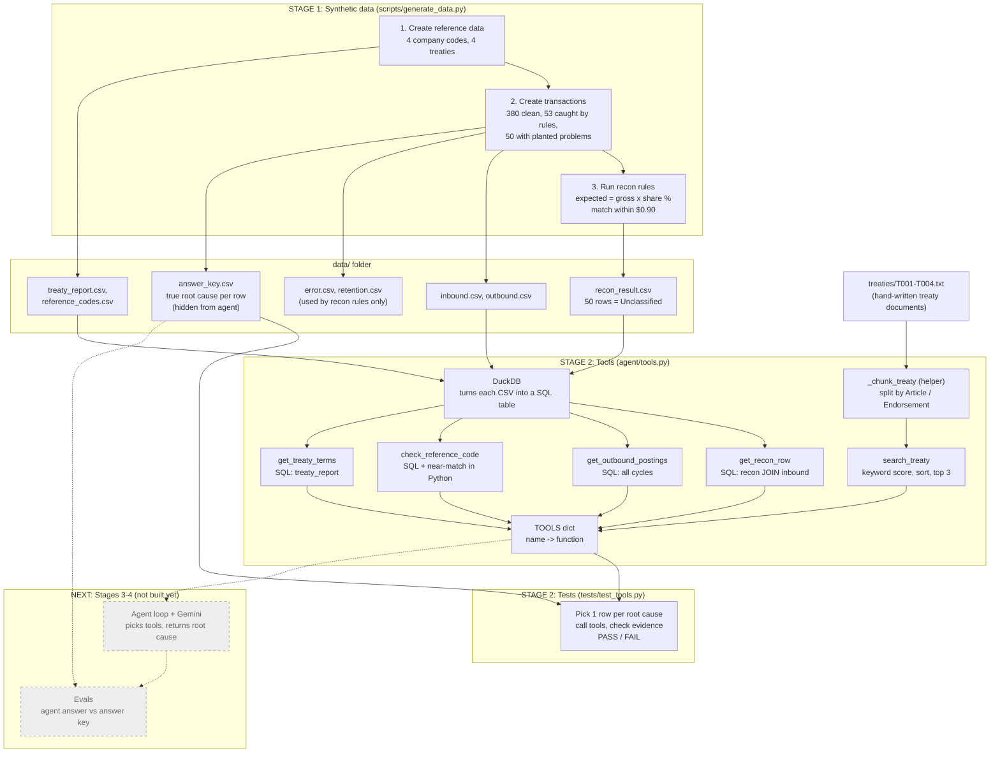

# Architecture (built so far)

Solid boxes are built. Dashed boxes are next.

```mermaid
flowchart TD
    subgraph S1["STAGE 1: Synthetic data  (scripts/generate_data.py)"]
        G1["1. Create reference data<br/>4 company codes, 4 treaties"]
        G2["2. Create transactions<br/>380 clean, 53 caught by rules,<br/>50 with planted problems"]
        G3["3. Run recon rules<br/>expected = gross x share %<br/>match within $0.90"]
        G1 --> G2 --> G3
    end

    TXT["treaties/T001-T004.txt<br/>(hand-written treaty documents)"]

    subgraph DATA["data/ folder"]
        REF["treaty_report.csv,<br/>reference_codes.csv"]
        CSV["inbound.csv, outbound.csv"]
        ERR["error.csv, retention.csv<br/>(used by recon rules only)"]
        RECON["recon_result.csv<br/>50 rows = Unclassified"]
        KEY["answer_key.csv<br/>true root cause per row<br/>(hidden from agent)"]
    end

    G1 --> REF
    G2 --> CSV
    G2 --> ERR
    G3 --> RECON
    G2 --> KEY

    subgraph S2["STAGE 2: Tools  (agent/tools.py)"]
        DUCK["DuckDB<br/>turns each CSV into a SQL table"]
        T1["get_recon_row<br/>SQL: recon JOIN inbound"]
        T2["get_outbound_postings<br/>SQL: all cycles"]
        T3["check_reference_code<br/>SQL + near-match in Python"]
        T4["get_treaty_terms<br/>SQL: treaty_report"]
        CH["_chunk_treaty (helper)<br/>split by Article / Endorsement"]
        T5["search_treaty<br/>keyword score, sort, top 3"]
        REG["TOOLS dict<br/>name -> function"]
        DUCK --> T1 & T2 & T3 & T4
        CH --> T5
        T1 & T2 & T3 & T4 & T5 --> REG
    end

    CSV --> DUCK
    REF --> DUCK
    RECON --> DUCK
    TXT --> CH

    subgraph TEST["STAGE 2: Tests  (tests/test_tools.py)"]
        TS["Pick 1 row per root cause<br/>call tools, check evidence<br/>PASS / FAIL"]
    end
    KEY --> TS
    REG --> TS

    subgraph NEXT["NEXT: Stages 3-4 (not built yet)"]
        AG["Agent loop + Gemini<br/>picks tools, returns root cause"]
        EV["Evals<br/>agent answer vs answer key"]
    end
    REG -.-> AG
    AG -.-> EV
    KEY -.-> EV

    classDef future fill:#eee,stroke:#999,stroke-dasharray:5 5,color:#666
    class AG,EV future
```
